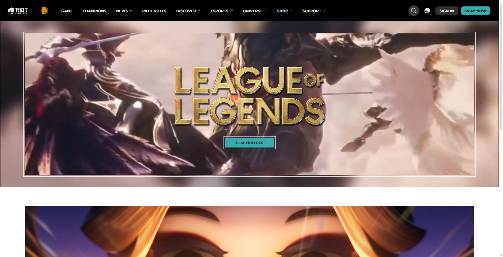
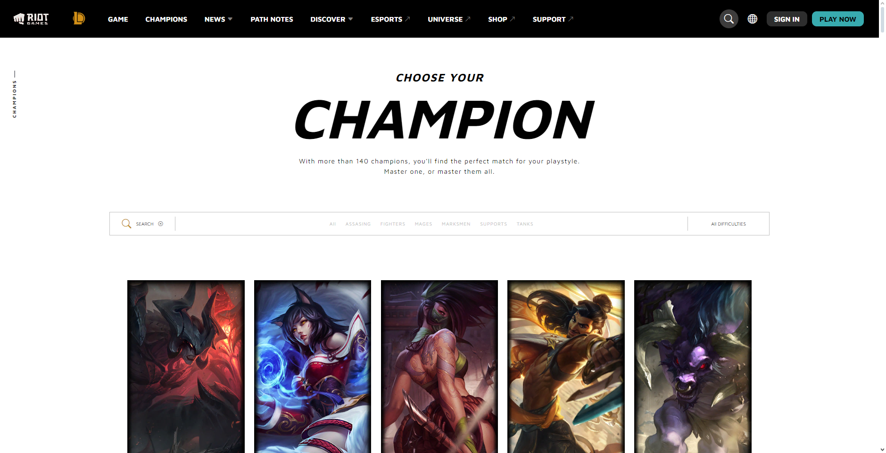
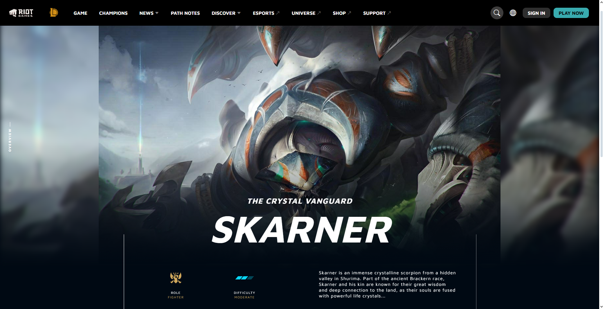

<h1 align="center" id="title">League Of Legends Page using React</h1>

<p align="center"></p>

<p id="description">¡Bienvenido a mi réplica de la página oficial de League of Legends construida con React! Este proyecto es una recreación de la famosa página web del juego diseñada para mostrar las últimas noticias actualizaciones campeones y características del juego todo ello utilizando las últimas técnicas y buenas prácticas de desarrollo en React.</p>

## Descripción del Proyecto

Este proyecto tiene como objetivo proporcionar una versión actualizada y totalmente funcional de la página web de League of Legends, utilizando las mejores prácticas de desarrollo en React. Algunas de las características y tecnologías destacadas incluyen:

- **React**: Utilizamos React, una biblioteca JavaScript de código abierto mantenida por Facebook, para construir la interfaz de usuario dinámica y receptiva de nuestra aplicación.

- **Componentes Reutilizables**: Implementamos componentes reutilizables para mantener nuestro código limpio, modular y fácil de mantener.

- **Enrutamiento con React Router**: Utilizamos React Router para gestionar la navegación dentro de nuestra aplicación y permitir una experiencia de usuario fluida y sin problemas.

- **Consumo de API de League of Legends**: Integramos la API oficial de League of Legends para obtener datos en tiempo real sobre campeones, actualizaciones y noticias del juego. Utilizamos esta API para mostrar información actualizada sobre los campeones, estadísticas del juego y noticias relevantes.

- **Estilizado con CSS y Sass**: Utilizamos CSS y Sass para estilizar nuestra aplicación y lograr un diseño atractivo y coherente.

- **Responsive Design**: Diseñamos nuestra aplicación para que sea completamente receptiva, asegurándonos de que se vea bien y funcione correctamente en una variedad de dispositivos y tamaños de pantalla.

## Instalación y Uso

Para ejecutar localmente este proyecto, sigue estos pasos:

1. Clona este repositorio en tu máquina local utilizando Git:
   ```
   git close https://github.com/juanhuamani/League-Of-Legends-Page-Copy
2. Navega hasta el directorio del proyecto:
   ```
   cd League-Of-Legends-Page-Copy
   cd front-end
3. Instala las dependencias del proyecto utilizando npm:
   ```
   npm install
4. Inicia la aplicación en modo de desarrollo:
   ```
   npm start
## Project Screenshots




